<!-- PROJECT LOGO -->
<br />
<div align="center">
  <a href="https://athletesimulator-bf10928fd99f.herokuapp.com/">
    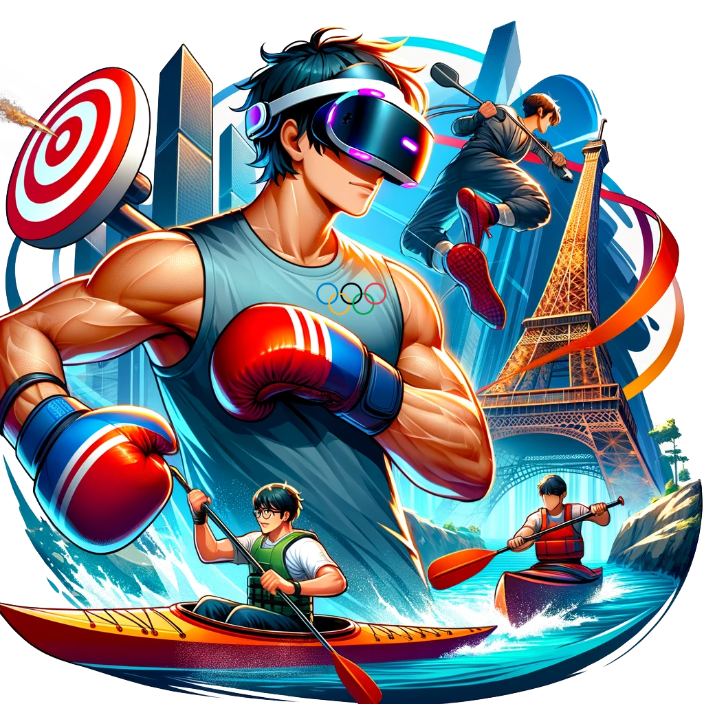
  </a>

  <h1 align="center">Athlete Simulator</h1>

  <p align="center">
    Games on web 2024 Olympic edition
    <br />
    <a href="https://youtu.be/k0ebpO5Bg98"><strong>Vidéo démo 🎬»</strong></a>
    <br />
    <br />
    <a href="https://athletesimulator-bf10928fd99f.herokuapp.com/">🎮Tester le jeu</a>
    ·
    <a href="https://github.com/Athlete-Simulator/GOW2024/issues">🐛Report Bug</a>
    ·
    <a href="https://github.com/Athlete-Simulator/GOW2024">🌟Repository avec le code</a>
  </p>
</div>


<!-- TABLE OF CONTENTS -->
<details>
  <summary>Table des matières📚</summary>
  <ol>
    <li>
      <a href="#about-the-project">Athele simulator VR📖</a>
      <ul>
        <li><a href="#built-with">Développé à l'aide de 🛠️:</a></li>
      </ul>
    </li>
    <li>
      <a href="#getting-started">Pour Commencer🚀</a>
      <ul>
        <li><a href="#prerequisites">Prérequis</a></li>
        <li><a href="#installation">Installation💻</a></li>
      </ul>
    </li>
    <li><a href="#usage">Utilisation🎮</a></li>
    <li><a href="#roadmap">Contrôles🕹️</a></li>
    <li><a href="#license">Quelques Spoils📸</a></li>
    <li><a href="#details-des-jeux">Détails des Jeux 🕹️</a></li>
    <li><a href="#contact">Contact📧</a></li>
  </ol>
</details>


## Athlete Simulator📖

### Bienvenue dans le Lab Zone

En 2024, alors que le monde entier attend avec impatience le grand spectacle des Jeux Olympiques de Paris, les athlètes du monde entier sont introduits à un environnement d'entraînement révolutionnaire connu sous le nom de Lab Zone. Cet espace ultramoderne n'est pas seulement un lieu d'entraînement; c'est un royaume où la technologie de pointe et l'aspiration humaine se fusionnent pour créer le terrain d'entraînement ultime pour les espoirs olympiques.

### Le Lab Zone : Votre Passerelle vers la Gloire Olympique 🏆

Imaginez entrer dans un espace où les frontières entre le virtuel et le réel s'estompent. Le Lab Zone est équipé des dernières avancées en technologie VR, propulsée par BabylonJS 7, et améliorée avec des effets visuels époustouflants. Cet environnement immersif offre aux athlètes la chance de vivre l'intensité des Jeux Olympiques avec un réalisme inégalé.

### Des Jeux Vidéo Olympiques dans le Lab Zone 🥇

#### 1. Jeu de Boxe 🥊

Dans le jeu de boxe du Lab Zone, vous entrez dans le ring virtuel, ressentant la tension palpable et le rugissement de la foule. Chaque coup, chaque esquive, et chaque mouvement sont reproduits avec une précision incroyable grâce à la technologie de suivi de mouvement avancée. Affrontez un adversaire redoutable et affinez vos compétences avec des entraînements spécifiques conçus pour améliorer votre vitesse, votre force et votre stratégie. Vous ne vous entraînez pas seulement pour la victoire; vous vous préparez à devenir un champion olympique.

#### 2. Jeu de Canoë-Kayak 🚣

Le jeu de canoë-kayak du Lab Zone vous transporte sur la Seine de Paris pour une course palpitante contre trois adversaires en barque. Profitez d'une vue imprenable sur la Tour Eiffel tandis que vous pagayez avec détermination. La précision de votre technique et votre endurance sont mises à l'épreuve. Travaillez votre synchronisation et votre vitesse pour traverser la ligne d'arrivée en premier et revendiquer votre victoire.

#### 3. Jeu de Tir Sportif 🎯

Dans le jeu de tir sportif du Lab Zone, la précision est essentielle. Entrez dans un stand de tir virtuel ultra-réaliste où chaque détail, du son de la détonation au recul de l'arme, est fidèlement reproduit. Commencez par un entraînement intensif où vous devez réussir 11 points pour reculer la cible à la distance officielle des épreuves olympiques. Ensuite, passez à la phase de compétition où chaque tir compte : cinq tirs sont comptabilisés, avec un point vert pour chaque réussite et un point rouge pour chaque échec. Affinez votre visée et votre concentration pour atteindre la perfection.

### L'Aventure Commence

Votre aventure dans le Lab Zone va au-delà de l'entraînement; c'est une odyssée de découverte de soi et de poursuite incessante de l'excellence. Ici, vous rejoignez une communauté d'athlètes partageant la même vision, chacun motivé par le rêve de la gloire olympique. 


<br>
<br>


### Développé à l'aide de 🛠️ :


* 
* ![Node.js][Node.js]
* ![TypeScript][TypeScript]
* 
* 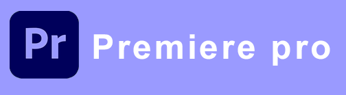
* 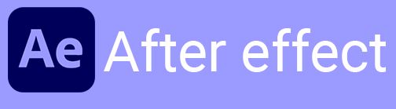
* 
* 
* 


<br>
<br>


## Pour commencer 🚀

<br>

### Prérequis ✨

Pour commencer, assurez-vous d'avoir Node.js installé sur votre machine. Ensuite, téléchargez ou clonez le projet depuis le repository :

```sh
git clone https://github.com/Athlete-Simulator/GOW2024.git
```

### Installation 💻

1. Accédez au répertoire du projet :

```sh
cd GOW2024
```

2. Installez les dépendances du projet :

```sh
npm install
```

3. Générez les certificats SSL nécessaires :

```sh
openssl req -newkey rsa:2048 -new -nodes -x509 -days 3650 -keyout key.pem -out cert.pem
```

4. Assurez-vous que votre casque VR est connecté au même réseau Wi-Fi que l'ordinateur sur lequel le serveur est hébergé.

5. Lancez le serveur en mode VR :

```sh
npm run vr
```

6. Depuis le navigateur de votre casque VR, entrez l'adresse IP de l'ordinateur hébergeant le serveur, suivie du port 8080 (par exemple, http://192.168.1.333:8080).
Le jeu Athlete Simulator se chargera dans votre casque VR. Utilisez les contrôles de votre casque VR pour interagir avec le jeu.

### Remarques

- Assurez-vous que les ports nécessaires sont ouverts sur votre pare-feu.
- Si vous rencontrez des problèmes de connexion, vérifiez la configuration réseau de votre casque VR et de votre ordinateur.
- Pour des performances optimales, un réseau Wi-Fi à faible latence est recommandé.

<br>
<br>


## Contrôles 🕹️

<br>
<br>


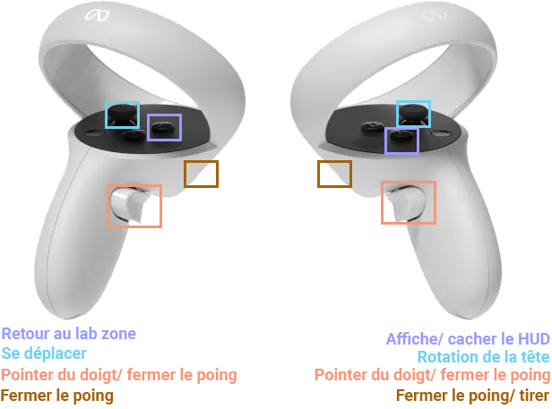


<br>
<br>
<br>


## Quelques Spoils 📸


<br>


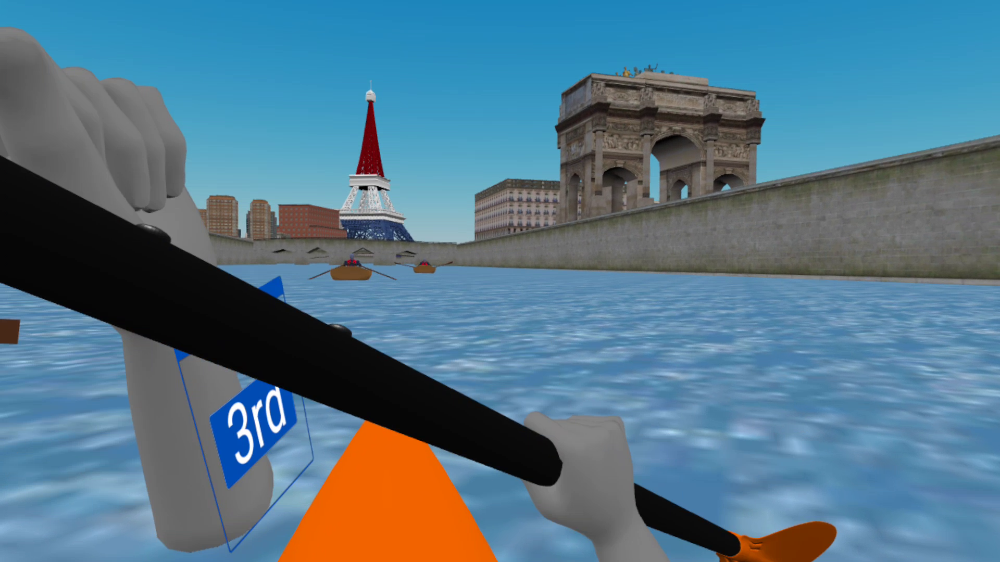

<br>

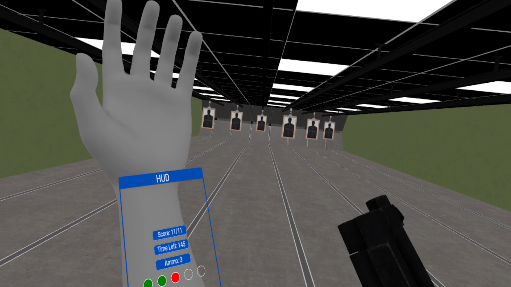

<br>

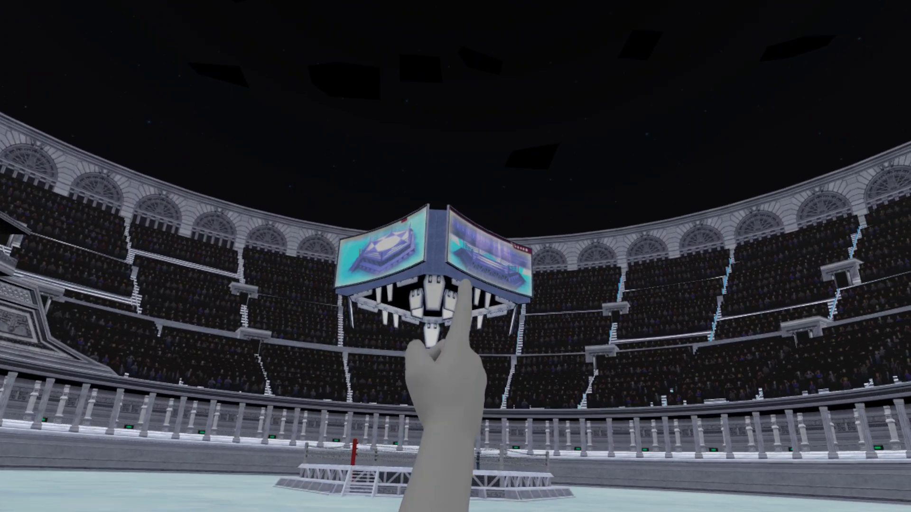

<br>

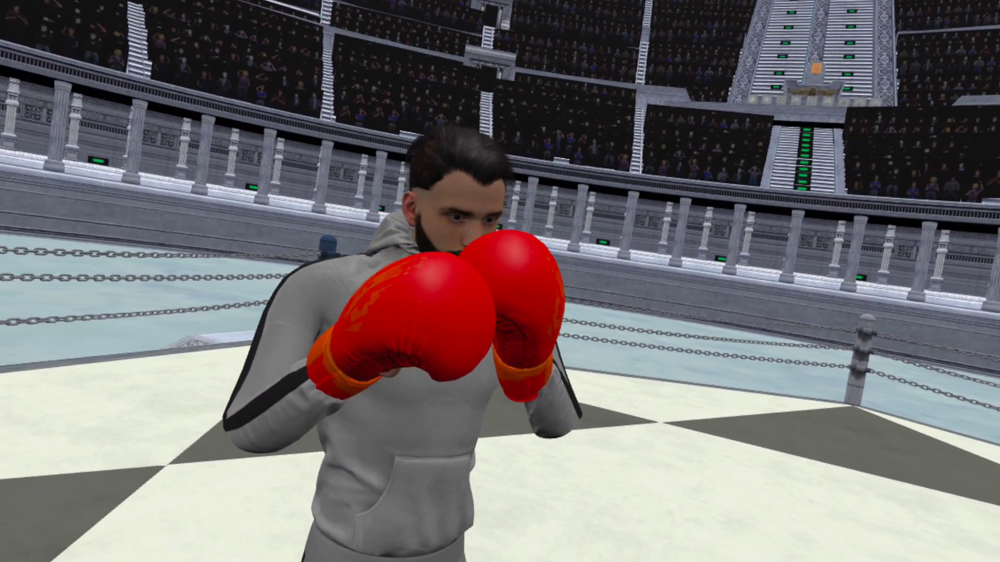

<br>

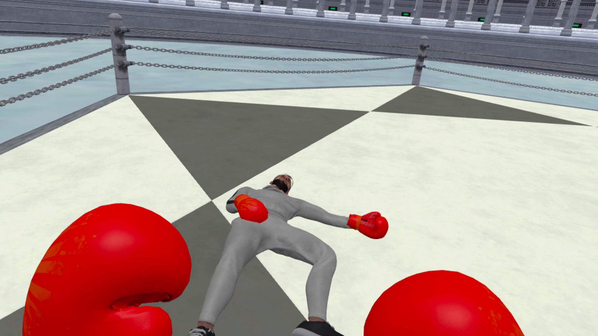


## Détails des Jeux 🕹️

### Lab Zone - Votre Environnement Virtuel 🌐

À votre arrivée dans le Lab Zone, vous aurez le choix entre trois jeux différents : la boxe 🥊, le canoë-kayak 🚣 et le tir sportif 🎯. Chacun de ces jeux est conçu pour offrir une expérience immersive et réaliste, vous permettant de vous entraîner comme un véritable athlète olympique.

### 1. Jeu de Boxe 🥊

#### Description 📜

Dans le jeu de boxe, vous vous retrouvez directement dans une arène de boxe virtuelle. Vous devrez prendre les escaliers pour entrer dans l'hexagone central, où vous affronterez Tony Shanks, un adversaire redoutable.

#### Objectif 🎯

Votre objectif est de réduire les points de vie (HP) de Tony Shanks de 100 à 0 en évitant ses gants et en frappant son corps. Chaque coup de poing réussi inflige 10 dégâts. Tony peut tomber K.O lorsqu'il a moins de 20 HP, mais il peut aussi se relever, ajoutant un défi supplémentaire.

#### Règles et Particularités 📋

- **HP de Tony Shanks**: Tony Shanks commence avec 100 HP et prend 10 dégâts par coup de poing touché.
- **Stratégie de défense**: Il peut se protéger avec ses gants, donc vous devez viser stratégiquement pour éviter ses parades.
- **Immunité K.O**: Vous ne pouvez pas tomber K.O, ce qui permet un entraînement sans risque et vous encourage à continuer à vous battre.
- **Retour automatique**: Si vous touchez les fils du ring, vous serez ramené à l'intérieur, empêchant toute fuite.
- **Accès au ring**: Prendre les escaliers pour monter dans le ring.
- **Redémarrage du jeu**: Après la fin du match, il est nécessaire de relancer le jeu pour rejouer en raison d'un bug actuel.

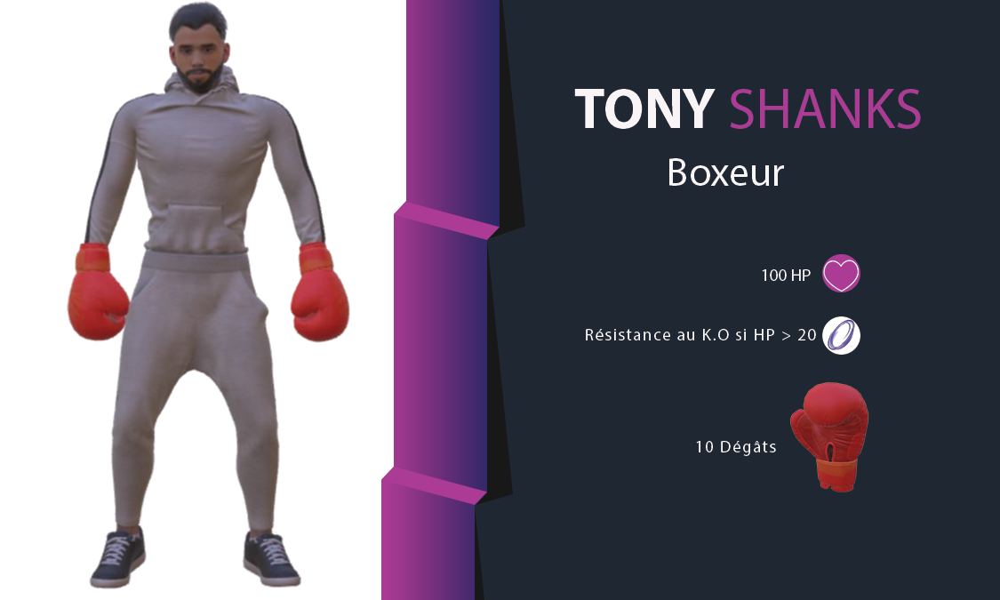

### 2. Jeu de Canoë-Kayak 🚣

#### Description 📜

Le jeu de canoë-kayak vous transporte sur la Seine, près de la Tour Eiffel, pour une course palpitante contre des adversaires virtuels appelés "Titan Modl".

#### Objectif 🎯

Votre but est de passer sous le dernier pont à côté de la Tour Eiffel pour gagner la course.

#### Règles et Particularités 📋

- **Vitesse des adversaires**: Les adversaires, Titan Modl, ont une vitesse variable de 6 à 18 km/h et une endurance illimitée.
- **Gestion du cardio**: Vous devez gérer votre cardio et l'endurance de vos épaules pour maintenir une performance optimale tout au long de la course.
- **Contrôle du kayak**: Ramer à droite fait tourner le kayak à gauche et vice versa, demandant une coordination précise.
- **Suivi de la position**: Utilisez le HUD pour suivre votre position par rapport aux adversaires et ajuster votre stratégie en conséquence.

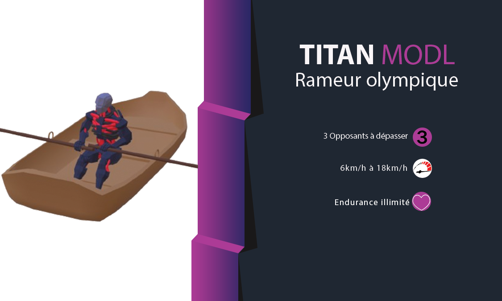

### 3. Jeu de Tir Sportif 🎯

#### Description 📜

Dans le jeu de tir sportif, la précision est essentielle. Vous entrez dans un stand de tir virtuel où chaque détail est reproduit avec une grande fidélité.

#### Objectif 🎯

L'objectif initial est de toucher 11 fois le centre rouge de la cible. Une fois cela accompli, vous devez réussir les 5 tirs suivants pour obtenir le meilleur score possible.

#### Règles et Particularités 📋

- **Temps limité**: Vous avez 180 secondes pour terminer la session, ajoutant une pression supplémentaire à chaque tir.
- **Cible initiale**: Vous devez toucher 11 fois le centre rouge de la cible pour avancer à l'étape suivante.
- **Scoring avancé**: Après avoir atteint l'objectif initial (score 11/11), chaque tir supplémentaire rapporte un point vert ou rouge.
- **Indicateurs HUD**: Vous pouvez suivre votre avancement depuis le HUD, vous indiquant votre progression et votre score.
- **Recharge illimitée**: Les chargeurs sont illimités et apparaissent sur la table une fois que vous avez épuisé les balles, vous permettant de vous concentrer sur votre précision sans interruption.

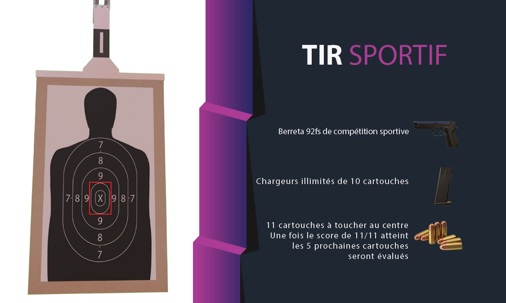

---


<!-- CONTACT -->
## Contact 📧

Adem BenJabria - Adem.bj@gmail.com - https://adem-benjabria.fr 
[![LinkedIn][linkedin-shield]][linkedin-url]

<br>

Merci d'avoir porté attention à mon projet ! 👍


<!-- MARKDOWN LINKS & IMAGES -->
<!-- https://www.markdownguide.org/basic-syntax/#reference-style-links -->

[contributors-shield]: https://img.shields.io/github/contributors/othneildrew/Best-README-Template.svg?style=for-the-badge
[contributors-url]: https://github.com/othneildrew/Best-README-Template/graphs/contributors
[forks-shield]: https://img.shields.io/github/forks/othneildrew/Best-README-Template.svg?style=for-the-badge
[forks-url]: https://github.com/othneildrew/Best-README-Template/network/members
[stars-shield]: https://img.shields.io/github/stars/othneildrew/Best-README-Template.svg?style=for-the-badge
[stars-url]: https://github.com/othneildrew/Best-README-Template/stargazers
[issues-shield]: https://img.shields.io/github/issues/othneildrew/Best-README-Template.svg?style=for-the-badge
[issues-url]: https://github.com/othneildrew/Best-README-Template/issues
[license-shield]: https://img.shields.io/github/license/othneildrew/Best-README-Template.svg?style=for-the-badge
[license-url]: https://github.com/othneildrew/Best-README-Template/blob/master/LICENSE.txt
[linkedin-shield]: https://img.shields.io/badge/-LinkedIn-black.svg?style=for-the-badge&logo=linkedin&colorB=555
[linkedin-url]: https://www.linkedin.com/in/adem-ben-jabria-532395221/
[product-screenshot]: images/screenshot.png
[Node.js]: https://img.shields.io/badge/Node.js-43853D?style=for-the-badge&logo=node.js&logoColor=white
[Node-url]: https://nodejs.org/
[TypeScript]: https://img.shields.io/badge/TypeScript-3178C6?style=for-the-badge&logo=typescript&logoColor=white
[TypeScript-url]: https://www.typescriptlang.org/
[AdobePremierePro-url]: https://www.adobe.com/fr/products/premiere/landpb.html?gclid=CjwKCAjwpuajBhBpEiwA_ZtfheMObLBs9Q4Vnxg6geNdVowGD85T5CcSFGh4cMJ_Bbj0lxPBGRWlURoCEUIQAvD_BwE&mv=search&mv=search&sdid=LQLZT7BT&ef_id=CjwKCAjwpuajBhBpEiwA_ZtfheMObLBs9Q4Vnxg6geNdVowGD85T5CcSFGh4cMJ_Bbj0lxPBGRWlURoCEUIQAvD_BwE:G:s&s_kwcid=AL!3085!3!341240727116!e!!g!!premier%20pro!1435912308!56537471939&gad=1
